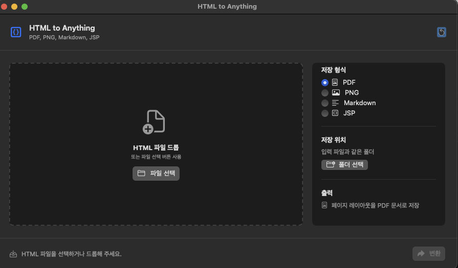

<p align="center">
  
</p>

<h1 align="center">HTML to Anything</h1>

<p align="center">
  A tiny macOS app that converts local HTML files into PDF, PNG, Markdown, or JSP.
</p>

<p align="center">
  <a href="https://github.com/eidenchoe-appstore/html-to-anything/releases/latest/download/HTMLToAnything.dmg"><strong>Download latest DMG</strong></a>
  ·
  <a href="documents/ko/README.md">한국어 README</a>
  ·
  <a href="https://github.com/eidenchoe-appstore/html-to-anything/releases">Releases</a>
</p>

<p align="center">
  <a href="https://github.com/eidenchoe-appstore/html-to-anything/releases/latest">
    
  </a>
  <a href="LICENSE">
    
  </a>
  
</p>

<p align="center">
  
</p>

## Overview

HTML to Anything is built for the simple workflow: drop one `.html` or `.htm` file, choose an output format, and save the result. It uses macOS WebKit for visual rendering, so local CSS, images, fonts, and other relative assets can be reflected in PDF and PNG exports.

## Features

| Format | Output | Asset behavior |
| --- | --- | --- |
| PDF | Rendered document | Uses local relative assets while rendering |
| PNG | Rendered snapshot | Uses local relative assets while rendering |
| Markdown | `.md` text file | Copies referenced local assets into `<name>_assets/` |
| JSP | `.jsp` file | Copies referenced local assets into `<name>_assets/` and rewrites paths |

## Download

Download the latest release:

[HTMLToAnything.dmg](https://github.com/eidenchoe-appstore/html-to-anything/releases/latest/download/HTMLToAnything.dmg)

After opening the DMG, drag **HTML to Anything** into **Applications**.

## Usage

1. Open **HTML to Anything**.
2. Drag a `.html` or `.htm` file into the drop area, or click **파일 선택** to choose a file manually.
3. Select the output format in the right panel:
   - **PDF** for a rendered document.
   - **PNG** for a rendered image snapshot.
   - **Markdown** for editable plain text.
   - **JSP** for an HTML-based JSP file.
4. Choose the destination folder with **폴더 선택**, or keep the default folder next to the input HTML file.
5. Click **변환**.
6. When conversion finishes, use **Finder에서 보기** to jump directly to the saved file.

## Output Behavior

The app never overwrites an existing output file. If a file with the same name already exists, it creates a numbered filename such as:

```text
report.pdf
report-1.pdf
report-2.pdf
```

For Markdown and JSP exports, local assets referenced by the HTML are copied into a sibling asset folder. This keeps the converted output portable without requiring you to manually copy image, CSS, or font folders.

## Asset-Aware Conversion

HTML files often depend on nearby folders such as `assets/`, `images/`, `css/`, `js/`, or `fonts/`.

For PDF and PNG, the app renders the HTML with read access to the HTML file's parent folder, so relative local assets are available during rendering.

For Markdown and JSP, the app copies referenced local assets into a sibling folder named after the output file:

```text
report.html
assets/logo.png

report.md
report_assets/assets/logo.png
```

Remote URLs, `data:` URLs, `mailto:`, `tel:`, and fragment-only links are left unchanged.

## Requirements

- macOS 14 or later
- No external command-line converter required

## Development

```bash
swift test
./script/build_and_run.sh --verify
./script/package_dmg.sh
```

The packaged DMG is written to:

```text
dist/HTMLToAnything.dmg
```

## Release

Current version: `1.0.1`

The app bundle is generated from SwiftPM, includes the app icon from `icon.icon/Assets/icon.png`, and is packaged into a verified DMG.

## License

Apache License 2.0. See [LICENSE](LICENSE).
